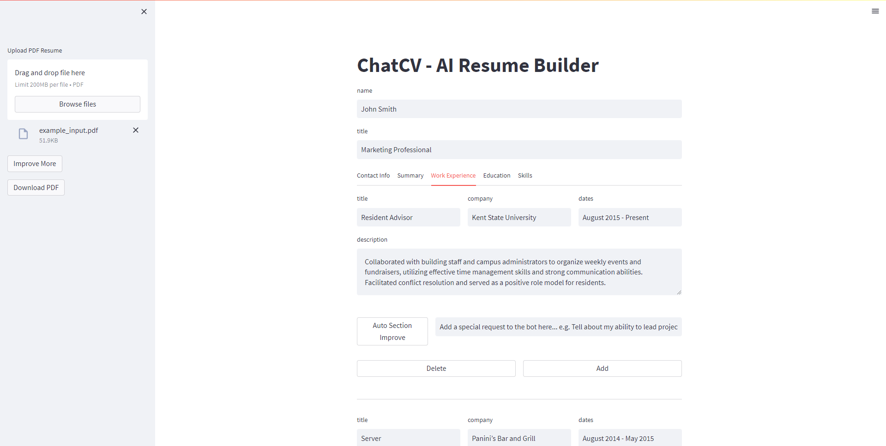

# ChatCV - Resume Builder with OpenAI ChatGPT

This code uses the OpenAI ChatGPT model to enhance resumes. It functions as a professional resume builder, taking in a PDF resume, processing it, and sending it to the chatbot for improvement. The improved resume can be downloaded.

Check out the demo of this project on [Hugging Face Spaces](https://huggingface.co/spaces/ofikodar/chatcv-resume-builder).

## Usage

- Paste your OpenAI API key
- Upload your PDF resume
- Wait for the chatbot to process your resume
- The chatbot will provide you with suggestions to enhance your resume
- Download the improved version of your resume

## Requirements

- revChatGPT
- pypdf2
- pdfkit
- streamlit
- wkhtmltox (HTML to PDF library, [installation instructions](https://wkhtmltopdf.org/downloads.html))

To use Resume Builder, you will need to have an OpenAI API Key, which can be obtained from [here](https://platform.openai.com/account/api-keys).

## Running the app
`streamlit run app.py --server.port=7860 --server.address=0.0.0.0 --server.enableXsrfProtection=false`

A Dockerfile is provided for convenience.
